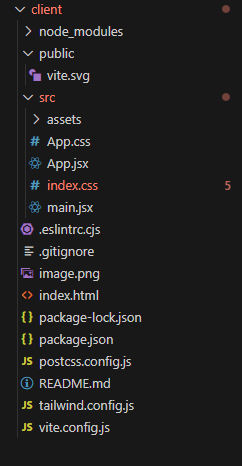

# Mike ReactJs - ViteJs Web3D Portfolio

# Video-Tutorial:
https://www.youtube.com/watch?v=ZqEa8fTxypQ

# reactjs basic template shortcut:
rafce

# React + Vite

# Instalación
 npm install three @react-three/fiber @react-three/drei maath valtio react-color framer-motion

 # ViteJS:
 
 https://tailwindcss.com/docs/guides/vite

npm create vite@latest my-project -- --template react
cd my-project
npm install -D tailwindcss postcss autoprefixer
npx tailwindcss init -p

# Tailwind config:

/** @type {import('tailwindcss').Config} */
export default {
  content: [
    "./index.html",
    "./src/**/*.{js,ts,jsx,tsx}",
  ],
  theme: {
    extend: {},
  },
  plugins: [],
}

# Tailwind CSS: index.css
At the begining of the file index.css:

@tailwind base;
@tailwind components;
@tailwind utilities;

# Structure:

- [@vitejs/plugin-react](https://github.com/vitejs/vite-plugin-react/blob/main/packages/plugin-react/README.md) uses [Babel](https://babeljs.io/) for Fast Refresh
- [@vitejs/plugin-react-swc](https://github.com/vitejs/vite-plugin-react-swc) uses [SWC](https://swc.rs/) for Fast Refresh
